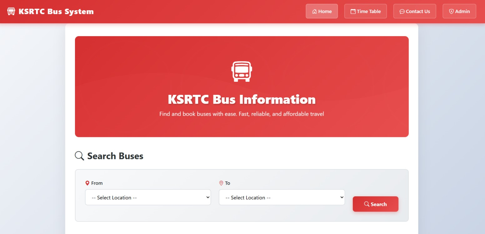
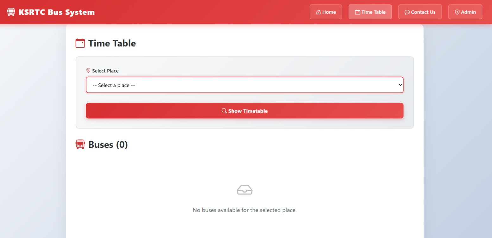
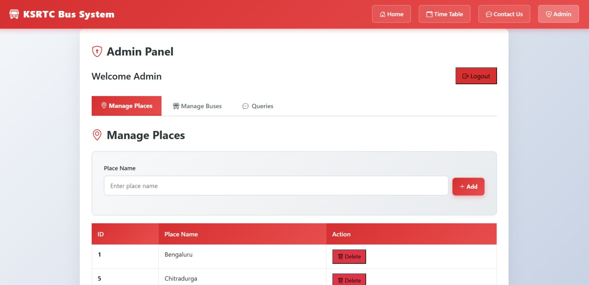

# KSRTC Bus Information System 🚍

## Home Page


## Timetable Page


## Admin Panel


## Project Description
The KSRTC Bus Information System is a web-based application developed to solve the problem of accessing **unreserved KSRTC bus schedule details**. The system provides users with accurate information about bus routes, departure timings, intermediate stops, and source-to-destination connectivity through a centralized digital platform.

This project follows a modern **full-stack architecture** using a React-based frontend, a Node.js + Express backend, and a MySQL relational database.

---

## Features
- Search buses by source and destination
- View unreserved bus schedules and timings
- Display intermediate (via) stops
- Interactive timetable view
- Contact Us module for user queries
- Admin panel to manage buses, places, and user queries
- REST API–based backend architecture

---

## Technology Stack

### Frontend
- React
- Vite
- JavaScript
- HTML & CSS

### Backend
- Node.js
- Express.js
- MySQL
- REST APIs
- dotenv, CORS

### Database
- MySQL (Normalized relational schema)

---

---

## Database Design
The database is designed using a normalized relational model and includes the following tables:
- `admin`
- `places`
- `buses`
- `timetables`
- `queries`

Foreign key constraints are used to maintain referential integrity.

---

## How to Run the Project

### 1. Clone the Repository
```bash
git clone https://github.com/Darshanbm05/Bus-Info-System.git
cd Bus-Info-System
```

### 2. Setup Database 
```bash
source backend/sql/schema.sql;
source backend/sql/seed.sql;
```

### 3. Backend Setup 
```bash
cd backend
npm install
npm start
```
### 4. Frontend Setup 
```bash
cd frontend
npm install
npm run dev
